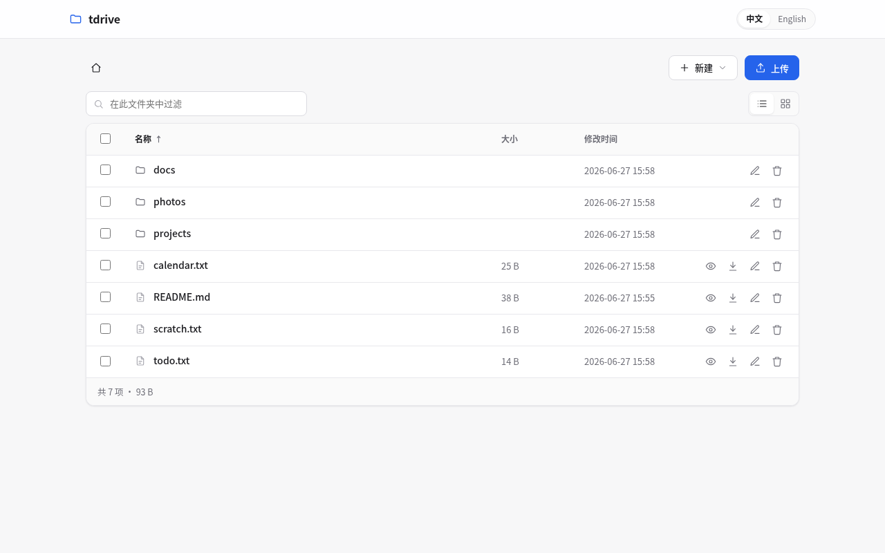

# tdrive

A single-user, self-hosted web file disk. Files live on the filesystem and are
served over **HTTP**, **WebDAV**, and **FTP** from one static binary — no
database, no config file, no frontend build.




## Features

- Web file browser (templ + htmx, no SPA): instant filter, click-to-sort, list/grid toggle, image thumbnails
- Upload via toolbar or drag-and-drop (chunked for large files); streaming downloads with HTTP range support
- View **and edit** text files; images, Markdown (GFM, Mermaid, KaTeX, code highlight), and HTML rendered inline
- Desktop-style selection, right-click menu (open / download / copy raw URL / rename / delete), keyboard shortcuts
- Multi-select batch delete and drag-and-drop move; create folders and text files inline, no modals
- Static URL for every file at `/raw/<path>`; nginx-style autoindex for folders
- Same files over HTTP, FTP (`--ftp-port`), and WebDAV (`/webdav`); REST API at `/api/v1`
- Path-safe by construction via Go `os.Root` — symlinks cannot escape the data directory
- Optional password protection, read-only mode, 中文 / English UI
- Native Windows service; clean SIGINT/SIGTERM shutdown for systemd / Docker

## Usage

```sh
tdrive                          # serve the current directory on http://localhost:3000
tdrive /srv/files               # serve a specific directory
tdrive --port 8080              # change the HTTP port
tdrive --host 127.0.0.1         # bind to one interface only
tdrive --ftp-port 2121          # also enable FTP
tdrive --password secret        # require a password
tdrive --readonly               # browse & download only
```

| Flag | Meaning | Default |
|---|---|---|
| `[root]` (positional) | directory to serve | `.` (current directory) |
| `--host` | bind address for HTTP and FTP | all interfaces |
| `--port` | HTTP port | `3000` |
| `--ftp-port` | enable the FTP server on this port | off |
| `--password` | access password (empty = no auth) | empty |
| `--readonly` | block all uploads, edits, and deletes | off |
| `--verbose` | debug logging | off |
